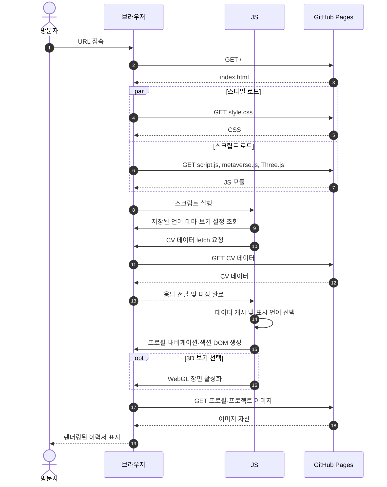

# MyHub 최초 페이지 로드 시퀀스 다이어그램 v1

```mermaid
sequenceDiagram
    autonumber
    actor V as 방문자
    participant B as 브라우저
    participant J as JS
    participant G as GitHub Pages

    V->>B: URL 접속
    B->>G: GET /
    G-->>B: index.html

    par 스타일 로드
        B->>G: GET style.css
        G-->>B: CSS
    and 스크립트 로드
        B->>G: GET script.js, metaverse.js, Three.js
        G-->>B: JS 모듈
    end

    B->>J: 스크립트 실행
    J->>B: 저장된 언어·테마·보기 설정 조회
    J->>B: CV 데이터 fetch 요청
    B->>G: GET CV 데이터
    G-->>B: CV 데이터
    B-->>J: 응답 전달 및 파싱 완료
    J->>J: 데이터 캐시 및 표시 언어 선택
    J->>B: 프로필·내비게이션·섹션 DOM 생성

    opt 3D 보기 선택
        J->>B: WebGL 장면 활성화
    end

    B->>G: GET 프로필·프로젝트 이미지
    G-->>B: 이미지 자산
    B-->>V: 렌더링된 이력서 표시
```
