# MyHub 데이터 스키마 정의서 v1

## 스키마

| 키 | 주요 필드 |
|---|---|
| `profile` | `photo`, `name`, `displayName`, `headline`, `roles`, `introTitle`, `about`, `focusAreas`, `details`, `contacts`, `affiliation`, `socials` |
| `education[]` | `start`, `end`, `degree`, `school`, `department`, `grade?`, `description` |
| `experience[]` | `start`, `end`, `organization`, `title`, `location`, `description` |
| `projects[]` | `category`, `start`, `end`, `organization`, `title`, `role`, `summary`, `highlights`, `skills`, `image`, `imageFit` |
| `publications[]` | `year`, `type`, `venue`, `title`, `authors` |
| `awards[]` | `year`, `title`, `organization`, `description` |
| `skills[]` | `category`, `items` |

## 데이터 타입 ERD

`localized_text`는 `ko`와 `en` 문자열로 구성된 값이며, `localized_value`는 일반 문자열 또는 `localized_text`이다.

```mermaid
erDiagram
    CV_SCHEMA ||--|| PROFILE : profile
    CV_SCHEMA ||--o{ EDUCATION : education
    CV_SCHEMA ||--o{ EXPERIENCE : experience
    CV_SCHEMA ||--o{ PROJECT : projects
    CV_SCHEMA ||--o{ PUBLICATION : publications
    CV_SCHEMA ||--o{ AWARD : awards
    CV_SCHEMA ||--o{ SKILL_GROUP : skills

    PROFILE ||--o{ PROFILE_ROLE : roles
    PROFILE ||--o{ FOCUS_AREA : focusAreas
    PROFILE ||--o{ PROFILE_DETAIL : details
    PROFILE ||--o{ CONTACT : contacts
    PROFILE ||--|| AFFILIATION : affiliation
    PROFILE ||--o{ SOCIAL : socials
    PROJECT ||--o{ PROJECT_HIGHLIGHT : highlights
    PROJECT ||--o{ PROJECT_SKILL : skills
    SKILL_GROUP ||--o{ SKILL_ITEM : items

    PROFILE {
        string photo
        localized_text name
        localized_text displayName
        localized_text headline
        localized_text introTitle
        localized_text about
    }

    PROFILE_ROLE {
        localized_text value
    }

    FOCUS_AREA {
        localized_text value
    }

    PROFILE_DETAIL {
        localized_text label
        localized_value value
        string href "optional"
    }

    CONTACT {
        localized_text label
        string value
        string href
    }

    AFFILIATION {
        localized_text organization
        localized_text position
    }

    SOCIAL {
        localized_text label
        string url
    }

    EDUCATION {
        string start
        string end
        localized_text degree
        localized_text school
        localized_text department
        string grade "optional"
        localized_text description
    }

    EXPERIENCE {
        string start
        string end
        localized_text organization
        localized_text title
        localized_text location
        localized_text description
    }

    PROJECT {
        localized_text category
        string start
        string end
        localized_text organization
        localized_text title
        localized_text role
        localized_text summary
        string image
        string imageFit
    }

    PROJECT_HIGHLIGHT {
        localized_text value
    }

    PROJECT_SKILL {
        string value
    }

    PUBLICATION {
        string year
        localized_text type
        localized_text venue
        localized_text title
        localized_text authors
    }

    AWARD {
        string year
        localized_text title
        localized_text organization
        localized_text description
    }

    SKILL_GROUP {
        localized_text category
    }

    SKILL_ITEM {
        string value
    }
```

